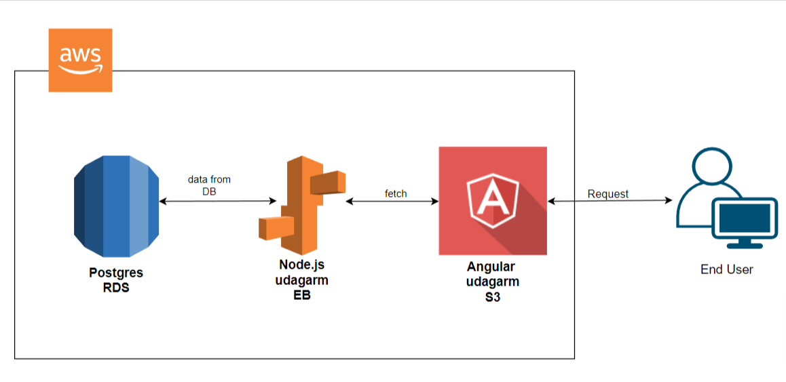

# Infrastructure

## AWS services

RDS

-   uses AWS RDS Postgres as database.

Elastic Beanstalk

-   use Elastic Beanstalk as backend hosting
-   EB URL : http://udagram-api-env.eba-uvwdemxh.us-east-1.elasticbeanstalk.com/

S3 Bucket

-   using AWS S3 Bucket to host fronend.
-   Bucket URL: http://udagram1.s3-website-us-east-1.amazonaws.com

## diagram

